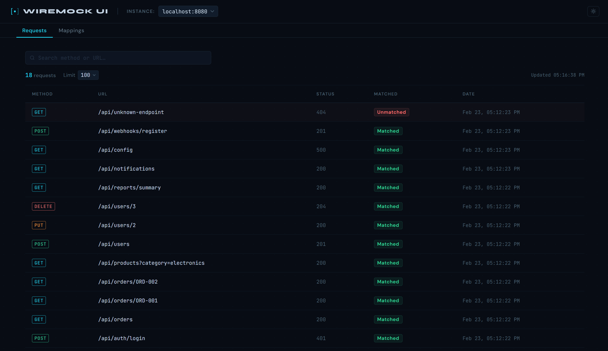
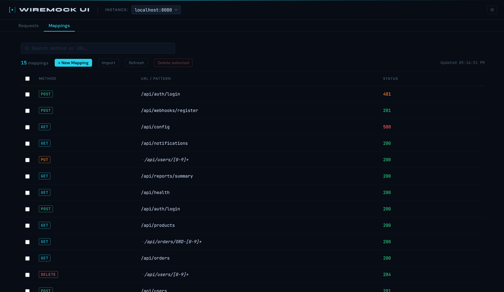
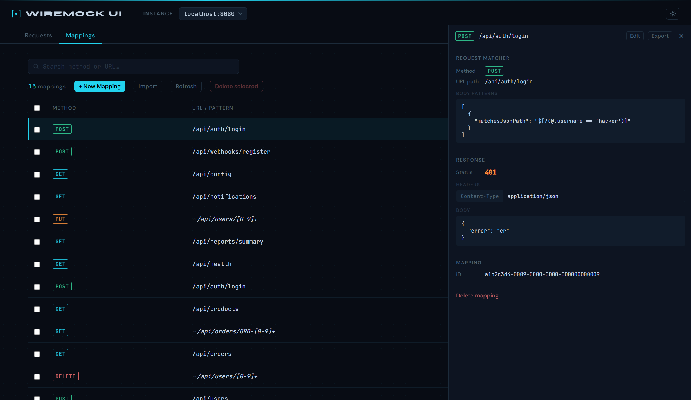
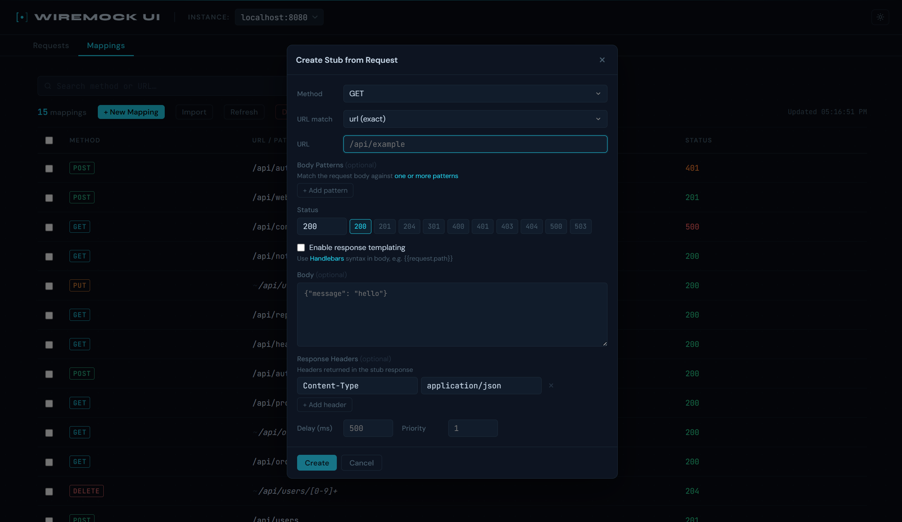

# WireMock UI

A web dashboard for inspecting recorded HTTP requests and managing stub mappings across one or more running WireMock instances.

## Screenshots

**Requests tab** — live log of recorded requests with method, status, and match status at a glance



**Request detail** — slide-out drawer with full headers, body, response status, and matched stub ID


**Mappings tab** — searchable table of all stub mappings with bulk-select and delete



**Mapping detail** — request matchers, response config, and inline editing in one panel



**Create stub** — form-based editor pre-filled from a captured request, with full response control



## Features

### Multi-Instance Support
Connect to multiple WireMock servers simultaneously. Switch between instances using the instance selector — each instance is identified by its `host:port`. Instances are configured via a single environment variable.

### Request Inspection
- **Live request log** — auto-refreshes every 3 seconds, showing the latest recorded requests
- **Configurable limit** — choose how many requests to display (20, 50, 100, 200, or all)
- **Search and filter** — quickly narrow down requests by URL, method, or other fields
- **Full request/response detail** — click any request to open a slide-out drawer showing headers, body, match status, stub ID, and timestamp
- **Match status** — instantly see whether each request was matched by a stub or fell through unmatched

### Stub Mapping Management
- **Browse mappings** — view all stub mappings for the selected instance in a searchable table
- **Create mappings** — form-based editor supporting:
  - HTTP method and URL match type (`url`, `urlPath`, `urlPattern`, `urlPathPattern`)
  - Body pattern matchers
  - Response status code, headers, and body
  - Response templating toggle
  - Fixed delay
  - Priority
- **Edit mappings** — inline response body editing directly from the mapping detail drawer
- **Delete mappings** — per-row delete with confirmation, or bulk-select and delete multiple at once
- **Create stub from request** — open an unmatched request and click "Create Stub" to pre-fill the new mapping form with the request's method, URL, and body

### Cross-Drawer Navigation
Navigate from a request directly to its matched stub mapping and back, without losing your place.

### Dark / Light Theme
Toggle between dark (default) and light themes. The preference is persisted across sessions.

## Tech Stack

- **Frontend:** React 18, TypeScript, Vite, plain CSS
- **Fonts:** Syne, DM Sans, JetBrains Mono (via Google Fonts)

## Getting Started

### Prerequisites

- Node.js 18+
- One or more running [WireMock](https://wiremock.org/) instances with CORS enabled

### Installation

```bash
npm install
```

### Configuration

Copy `.env.example` to `.env` and set your WireMock URLs:

```bash
cp .env.example .env
```

```env
VITE_WIREMOCK_URLS=http://localhost:8080,http://localhost:8081
```

> **Note:** WireMock must be configured to allow CORS from the origin serving this UI. Add `--enable-stub-cors` when starting WireMock, or configure CORS in your WireMock settings.

### Development

```bash
# Start the Vite dev server
npm run dev
```

The frontend is served by Vite at `http://localhost:5173`. Requests go directly to WireMock's `/__admin/` API.

### Production

```bash
# Build the frontend
npm run build
```

The output in `dist/` is a static site that can be served by any web server or CDN.

## Environment Variables

| Variable | Default | Description |
|----------|---------|-------------|
| `VITE_WIREMOCK_URLS` | — | Comma-separated list of WireMock base URLs (required) |
